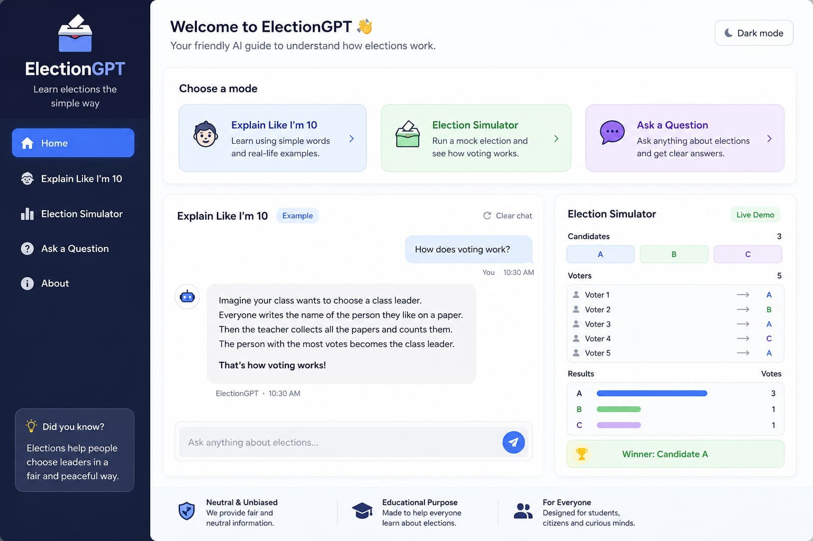

# election-gpt
AI assistant for explaining election processes in a simple and unbiased way
# 🗳️ ElectionGPT  
### *Learning elections the simple, human way*

---

## 🌟 Overview
ElectionGPT is a friendly AI assistant designed to explain how elections work in a way that feels natural, simple, and easy to understand.

Instead of sounding like a textbook, it teaches like a real teacher—using stories, everyday examples, and step-by-step thinking.

---

## ✨ What Makes It Special
- 🧒 Explains like you're 10 years old  
- 🗣️ Sounds like a real human teacher  
- 🧠 Uses structured prompt design  
- ⚖️ Keeps responses neutral and unbiased  
- 🎯 Focuses on understanding, not memorizing  

---

## 🧩 Prompt Design Philosophy
This project is built on one simple idea:

> *If a child can understand it, anyone can.*

The prompts are carefully designed to:
- Feel like real conversations  
- Avoid robotic or technical language  
- Use relatable examples (school, games, choices)  
- Build concepts step by step  

---

## 📂 Project Structure
